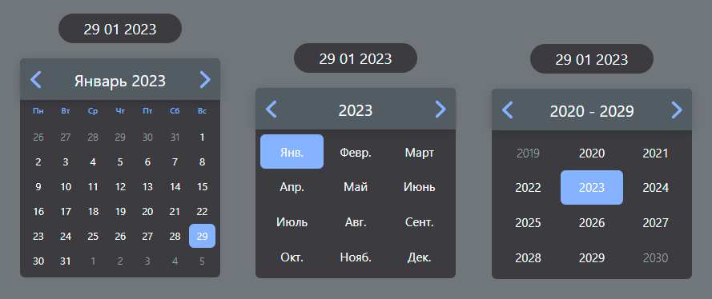

# **Custom calendar**

 
 
 
 

___
    
My project is a **calendar** component that can be used anywhere. The project was originally created using [create_react_app](https://create-react-app.dev). Link to [source](https://youtu.be/B8F9_IVgipw)

____

**<h2 align='center'>Project appearance</h2>**

This is what my component looks like. Here you can see 3 component states: in the days, months, years tab. To change the tab, you need to switch to the text between the arrows on top. The date above the calendar represents the selected date

____

**<h2 align='center'>Stack</h2>**

The project is mainly written on [React](https://reactjs.org/) technology. In particular, I came across the following concepts:

- **React hooks:**
  - useState
  - useMemo
  - useCalender (my custom hook)
- **Custom Utilite to work with JavaScript Date**
- **Typescript:**
  - Generic Types
  - Type for component properties
- **Dynamically added components and classes for components**